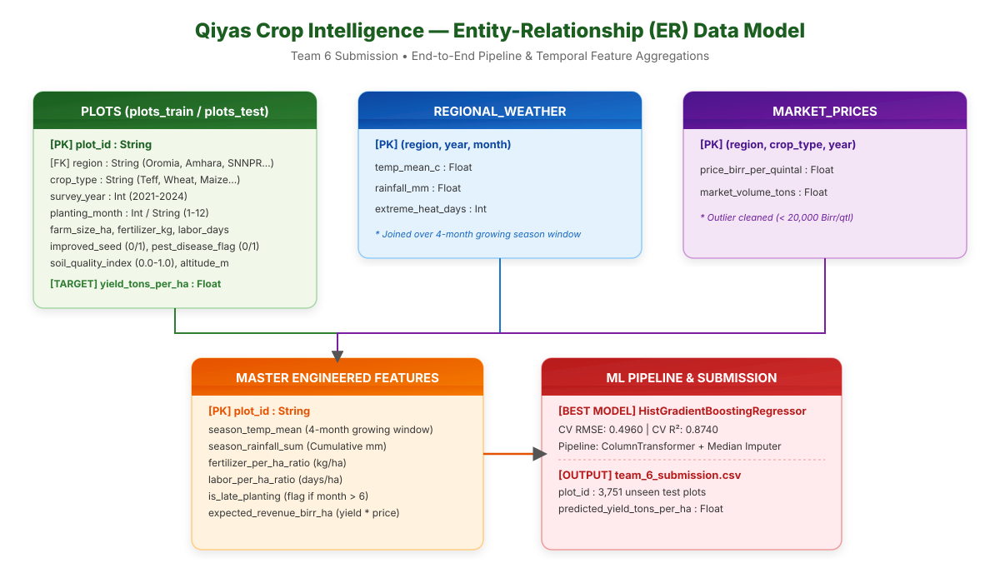

# 🌾 Qiyas Ethiopian Smallholder Crop-Yield Challenge — Team 6

[](https://www.python.org/)
[](https://nahom-abraham-jr.github.io/Crop_yield_forcast/)
[](LICENSE)

---

## 🌐 Live Web Application & Deployment Links

- 🚀 **Official Live Web Application**: [https://nahom-abraham-jr.github.io/Crop_yield_forcast/](https://nahom-abraham-jr.github.io/Crop_yield_forcast/)
- 📦 **GitHub Repository**: [https://github.com/Nahom-Abraham-Jr/Crop_yield_forcast](https://github.com/Nahom-Abraham-Jr/Crop_yield_forcast)

---

## 👥 Team Roster (Team 6)

| # | Name | Qiyas Registration ID | Role |
|---|------|----------------------|------|
| 1 | **Dawit Birhanu Mulu** | `qiyas-2026-004506` | Data Engineering & Pipeline |
| 2 | **Fetene Erkutena Nibret** | `qiyas-2026-004836` | Model Architecture & Hyperparameter Tuning |
| 3 | **Nahom Abraham Bekele** | `qiyas-2026-003344` | Feature Engineering & Analysis |
| 4 | **Haro Utura Kerro** | `qiyas-2026-007008` | EDA & Visualizations |
| 5 | **Kaleab Zerihun Teshome** | `qiyas-2026-003596` | Streamlit Demo App & UI/UX Design |

---

## 🗺️ Entity-Relationship (ER) Architecture Diagram (`gemini-svg`)



---

## 📌 Executive Summary

Smallholder agriculture accounts for over 80% of crop production in Ethiopia, yet yield estimation remains predominantly post-harvest, leaving farmers vulnerable to drought, pest outbreaks, and price shocks.

This project delivers an end-to-end Machine Learning pipeline and Decision Support Platform (**Qiyas Crop Intelligence**) to forecast plot-level crop yield (`yield_tons_per_ha`) across 5 major Ethiopian administrative regions (*Oromia, Amhara, SNNPR, Tigray, Somali*) and 5 core staple crops (*Teff, Wheat, Maize, Sorghum, Barley*).

---

## 📊 Cross-Validation Model Benchmark

5 model families were implemented, trained with 5-Fold Cross-Validation, and evaluated on out-of-fold predictions:

| Model Rank | Algorithm Family | CV RMSE (tons/ha) | CV R² | Key Hyperparameters / Config |
|:----------:|------------------|:-----------------:|:-----:|------------------------------|
| 🥇 **1** | **Hist Gradient Boosting Regressor** | **0.4960** | **0.8740** | `max_iter=100`, `max_depth=15`, median imputation |
| 🥈 **2** | **Random Forest Regressor** | **0.5450** | **0.8490** | `n_estimators=100`, `max_depth=25` |
| 🥉 **3** | **Ridge Regression** | **0.9130** | **0.5740** | `alpha=1.0`, One-Hot Encoded Categoricals |
| 4 | **Linear Regression (OLS)** | **0.9130** | **0.5740** | Standard OLS baseline |
| 5 | **Dummy Baseline** | **1.4000** | **-0.0010** | Predicts training mean |

*Best Model*: **HistGradientBoostingRegressor** achieves **0.496 RMSE** and **87.4% R²**, significantly outperforming baseline models.

---

## 📁 Repository Structure

```
team_6/
├── README.md                           # Main project documentation & team roster
├── requirements.txt                    # Python dependencies
├── app/
│   └── app.py                          # Streamlit Interactive Web Application
├── data/
│   ├── raw/                            # Raw CSV files (plots, weather, market prices)
│   └── processed/                      # Merged master train/test sets with engineered features
├── figures/
│   └── fig12_feature_importance.png    # Figure 12: Permutation Feature Importance plot
├── models/
│   └── final_model.joblib              # Serialized production model pipeline
├── notebooks/
│   ├── 01_cleaning_and_integration.ipynb # Deliverable A: Data cleaning & time-series join
│   ├── 02_analysis_report.ipynb          # Deliverable B: Exploratory & statistical analysis
│   ├── 03_visualizations.ipynb           # Deliverable C: Core data visualizations
│   └── 04_modeling_and_evaluation.ipynb # Deliverable D & E: 5-Model evaluation & export
├── reports/
│   ├── A_cleaning_and_integration.md
│   ├── B_analysis_report.md
│   ├── D_model_evaluation.md
│   └── FINAL_DOCUMENTATION.md          # Comprehensive full project submission report
└── submission/
    └── team_6_submission.csv           # Final predictions (3,751 plots)
```

---

## ⚡ Quick Start & Setup

### 1. Environment Installation
```bash
git clone https://github.com/Nahom-Abraham-Jr/Crop_yield_forcast.git
cd Crop_yield_forcast/team_6
pip install -r requirements.txt
```

### 2. Run Streamlit Web Application
```bash
streamlit run app/app.py
```
Access the application at `http://localhost:8501`.

### 3. Re-run End-to-End Notebook Pipeline
```bash
jupyter nbconvert --execute notebooks/01_cleaning_and_integration.ipynb
jupyter nbconvert --execute notebooks/02_analysis_report.ipynb
jupyter nbconvert --execute notebooks/03_visualizations.ipynb
jupyter nbconvert --execute notebooks/04_modeling_and_evaluation.ipynb
```

---

## 📄 License
This project is licensed under the MIT License — see [LICENSE](LICENSE) for details.
